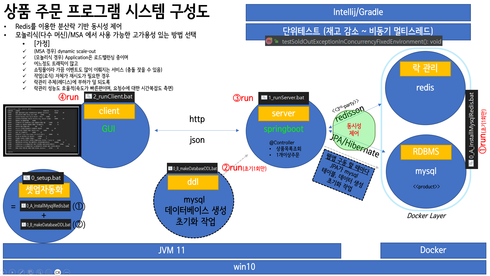

# 29CM 상품 주문 프로그램 

## ※ 공통설명
### 프로젝트 구성 (3가지)
* 1. `ddl`: 로컬 구동 위한 준비 과정중 mysql 데이터베이스 생성하는 jdbc 배치프로그램 (최초 셋업에서 1회만 수행)
* 2. `server`: 로컬 구동 위한 스프링부트앱 기반 API 
* 3. `client`: 로컬 구동 위한 콘솔프로그램

### 시스템 구성도


### 저는 29CM 상품 주문 프로그램 프로젝트 과제를 수행하면서 이러한 `주안점`을 두고 개발하였습니다
* 요구사항 기능 구현 시 동시성 이슈가 발생되어 이를 해결하고자 했다.
* 그럴듯한 쇼핑몰 기능 구현 부분은 부족하지만 요구사항에 맞는 MVP 수준이라고 판단하였다.
* 이러한 판단하에서, 과제의 주안점은 동시성 관리가 과제의 핵심 문제라고 정의하였다.
* 이에 대해 `상황(29cm팀 요구사항명세서 + 나의 요구사항명세서)`에 맞는 가장 적절한 솔루션/기술을 찾고 적용하는 부분에 시간을 할애하고자 했다.
* 어노테이션 붙이는 순서(중요도 순), 변수 명명(길어도 알수 있도록 카멜케이스), 폴더구조(응집도 있는 표준화된 폴더 구조)는 가독성 있고 유지보수 확장에 가능하면 어울리게 정하였다.
* (제가) 부끄럽지만 그동안 한번도 써보지 않았던 기술/지식 으로 프로젝트를 시도 하고자 했다 (IDE, jpa/hibernate ORM, gradle, docker, docker-compose, redis, 동시성 관리) 
* 이전 자바웹개발 시, 솔직히 의식적으로 적용하지 못했던 디자인패턴을 적용해보았다. (Open Closed Principle(OCP), Single Responsibility Principle(SRP))
* 이외에도 최대한 OOP, AOP 개념을 필요한 기능에 적절히 적용하여 응집도 있고 재사용성 높게 개발하고자 했다.
* 클라이언트 프로그램은 모든 케이스에대해서 유효성 검사를 추가적으로 타이트하게 하였다. (서버로 쓸데 업이 불필요한 값 발생 최소화)
* 과제를 보는 사람에게 최소한의 설치시간으로 문제없이 구동 될 수 있도록 배포하자.
* 배포된 프로그램과 별개로 가이드/매뉴얼 문서를 최대한 상세히 작성하자 (길더라도 구동을 못하여 프로그램 외적인 방법으로 상대 시간을 아끼자). 
* 혹여, 구동이 안되는 상황을 대비해 로컬환경에서의 각 프로그램들의 설치/구동 과정을 동영상으로 녹화 해서 첨부하자. 

### `29cm팀 요구사항명세서`를 상속받아서 `구현`(Implementation)하고 `나의 요구사항명세서`를 추가
* (가정) 어느정도 규모가 있는 트래픽 서비스
* (가정) 이미 redis를 캐싱 용도로 사용중
* (가정) 모놀리식/MSA 든 WAS는 클라우드 기반으로 여러개의 머신에서 동작 중
* (제안) 다중상품 주문 시 1개가 재고가 부족하면 나머지 상품이 일괄 주문 취소되는 상황은 고객경험 관점에서 별로인 시나리오라고 판단하여, 재고 부족 상품 제외하고 나머지 상품은 주문 되어야 함

### 실험: 동시성 제어 방법(redis 기반 분산락 방식) 의 요청 수 대비 처리량 성능 실험 
* 실험목적
  * 선택한 동시성제어방법의 성능(시간복잡도)은 어떤지 확인하고 싶었다.

* 실험방법
  * 10회 수행하여 평균
  * 충돌 나지 않을 때까지 요청 수 증량

* 실험 환경/조건
  * win10 x64 11th Gen Intel(R) Core(TM) i7-11700F @ 2.50GHz   2.50 GHz
  * 최대 10초 동안 (락획득 시도 1번)

* 결과
  * 
  * 

* 해석 및 결론
  * 다른 방법들과 비교해야 겠지만 레디스+redisson 으로 분산락 제어하는 성능이 효율적임을 확인했다. 
  * 머신 사양 / 락획득 조건에 따라서 실험은 미미하게 영향이 있을 것 같다.
  * 머신 사양에 따라 다르겠지만 실험환경(로컬)에서는 10,000회 까지 `log(O)` 의 경향성을 갖는 시간복잡도임을 확인했다. -> 효율적임을 확인했다.


### 제출한 과제 압축폴더 구조
```bash
29cm_homework_outputs
    ├─1_preinstallation                         // 사전 설치 프로그램
    │      Docker Desktop Installer.exe         // 도커 데스크톱  
    │      jdk-11.0.19_windows-x64_bin.exe      // jdk11 (혹은 jre)
    │
    ├─2_program_for_windows10                   // 로컬환경 구동 위한 윈도우용 배치프로그램
    │  │  0_A_installMysqlRedis.bat             // 도커로 로컬환경에 mysql, redis 설치 -> ⚠ 최초 1회 실행
    │  │  0_B_makeDatabaseDDL.bat               // 과제 로컬 구동 위한 DDL(데이터베이스 생성 만) 작업 자동화 -> ⚠ 최초 1회 실행
    │  │  0_setup.bat                           // 0_A_* 배치파일과 0_B_* 배치파일을 개별실행이 아닌 한번에 실행 -> ⚠ 최초 1회 실행
    │  │  1_runServer.bat                       // 스프링부트앱(API) 구동
    │  │  2_runClient.bat                       // 스프링부트앱과 연동되는 Client 자바콘솔프로그램 구동
    │  │
    │  └─resource                               // 배치프로그램에서 사용하는 jar 파일
    │          client-1.0.0-SNAPSHOT.jar        // 클라이언트 콘솔프로그램 jar
    │          ddl-1.0.0-SNAPSHOT.jar           // 서버 스프링부트 API 프로그램 jar
    │          server-1.0.0-SNAPSHOT.jar        // 과제 로컬 구동 위한 DDL(데이터베이스 생성) 작업 일부 자동화 프로그램 jar
    │
    │─3_code                                     // 프로젝트별 소스코드 압축본
    │ │   ddl 프로젝트                            // 콘솔프로그램 
    │ │   server 프로젝트                         // 스프링부트 API 프로그램
    │ └─  client 프로젝트                         // 콘솔프로그램 (화면/입력)
    └─[매뉴얼] 로컬구동환경 구축 및 프로그램 구동 시연.mp4 // 동영상 매뉴얼 및 시연 영상
```

### 로컬환경 구축/프로그램 실행 매뉴얼 (Win10)
> **주의:**
> 아래 순서대로 진행
* 로컬환경 구축
  * 1.`1_preinstallation` 의 도커데스크톱&jdk11 설치
  * 2.`2_program_for_windows10` 의 `0_setup.bat` 실행하여 로컬환경구축
  > 여기까지 로컬환경 구축 완료. 초기에 1회만 하면 됨.
* 실행
  * 1.`2_program_for_windows10` 의 `1_runServer.bat` 실행하여 API 실행
  * 2.`2_program_for_windows10` 의 `2_runClient.bat` 실행하여 주문프로그램 GUI 실행

***

## 1. `ddl` 프로젝트

### 개발환경

* Win10 x64
* IntelliJ Pro
* JDK azul-15.0.10
* java 11+
* Dependencies:
  * mysql-connector-java 8.0.33

### 역할
* 초기작업 DDL
  * jdbc 기반으로 도커로 설치된 mysql에 접속
  * stock_example 이라는 `데이터베이스` 명 생성
  * 비고
    * 최초 1회만 수행한다
    * (`테이블 생성과 데이터 삽입`은 `server`애플리케이션 서버 구동 시 마다 초기화하며 수행

### 관련 빌드파일
* `29cm_homework_outputs\2_program_for_windows10\resource` + `ddl-1.0.0-SNAPSHOT.jar`

### 관련배치프로그램
* `29cm_homework_outputs\2_program_for_windows10` + `0_B_makeDatabaseDDL.bat`

### 필요한 사전작업
* `29cm_homework_outputs\1_preinstallation` 폴더
  * Docker Desktop 설치
  * jdk11 설치
* `29cm_homework_outputs\2_program_for_windows10` 폴더
  * 방법1: `0_A_installMysqlRedis.bat`, `0_B_makeDatabaseDDL.bat` 순서대로 각각 수행하거나
  * 방법2: `0_setup.bat ` 수행하여 한번에 설치

***

## 2. `client` 프로젝트 (client side 용)
> 소스코드에 workflow와 모듈이 최대한 잘 이해되도록 주석을 달아놓았으니 참고해주시면 감사드립니다 

### 폴더구조


***

## 3. `server` 프로젝트 (server side 용)
> 소스코드에 workflow와 모듈이 최대한 잘 이해되도록 주석을 달아놓았으니 참고해주시면 감사드립니다

### 폴더구조


```agsl

```